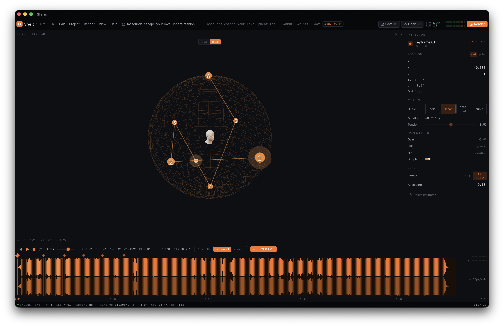

# Sferic

> **Spatialize sound through time.** Desktop tool for binaural HRTF audio with a visual 3D keyframe interface.

[](LICENSE)
[](https://tauri.app)
[](https://react.dev)
[](https://www.typescriptlang.org)

Sferic places a sound source anywhere around a listener's head and animates it in 3D over time. Visual keyframing on a unit sphere or in twin orthographic views, HRTF binaural panning via the Web Audio API, and a tight realtime engine with offline export. The kind of "8D audio" effect popularised by tracks like Billie Eilish's *ilomilo* (Pentatonix cover) — but as a precision tool, not a one-button gimmick.

🌐 **Website**: [dim971.github.io/sferic](https://dim971.github.io/sferic/)



---

## Features

- **HRTF binaural panning** — Web Audio API `PannerNode` in HRTF mode, sample-accurate, fully realtime.
- **Visual 3D keyframing** — drop nodes anywhere on a unit sphere; the trajectory is a smooth interpolated path through them. Curves per node: linear, ease-out, cubic, hold.
- **Two views, one mix** — top (X/Z) and side (Z/Y) orthographic projections side by side, or a perspective scene with orbit controls.
- **Per-keyframe audio** — gain, low-pass, high-pass, doppler, air absorption, reverb send. Tension per node.
- **Spatial enhancement** — directional low-pass + reverb lift so positions behind / above / below read clearly on headphones.
- **Realtime + offline render** — audition with the live engine, then bounce to WAV (16/24/32-bit) or MP3 from the same project.
- **Persisted projects** — `.sferic.json`, text-readable, versioned, diff-friendly.
- **Loop, snap, BPM** — loop a region while sculpting; snap angles (5°, 15°, 30°…); BPM auto-detection.
- **Native menu + shortcuts** — full Tauri OS menu, undo/redo, keyboard-driven workflow.
- **Built for the desktop** — Tauri 2 binaries, ~10 MB on macOS/Windows/Linux. Boots in under a second. No telemetry, no accounts.

---

## Install

Pre-built binaries are produced by GitHub Actions on every tagged release:

➡️ **[Download from Releases](https://github.com/dim971/sferic/releases/latest)** — macOS (universal), Windows (MSI), Linux (AppImage / .deb / .rpm).

Or build from source — see [Develop](#develop) below.

---

## Quick start

1. Launch Sferic.
2. **Open audio** with `⌘I` (or `Ctrl+I`) — pick a WAV / MP3 / FLAC / OGG / M4A.
3. Press space to play. While the track is running, click any empty area in the 2D top/side views or on the 3D sphere to drop a keyframe at the current playhead.
4. Drag keyframes to reposition. Tweak per-keyframe properties in the right-hand Inspector (gain, filters, doppler, curve type).
5. Press `⌘S` to save the project (`.sferic.json`), or `⌘R` to render to WAV / MP3.

Full keyboard reference: open *Help → Keyboard shortcuts* in the menu.

---

## Project layout

```
sferic/
├── app/                        the desktop application (Tauri 2 + React + TS)
│   ├── src/                    React frontend
│   ├── src-tauri/              Rust shell, native menu, fs/dialog plugins
│   └── public/                 static assets shipped with the app
├── site/                       landing site (Astro), deployed to GitHub Pages
├── design/                     visual reference screenshots
├── tasks/                      phase-by-phase implementation specs (historical)
├── prompts/                    AI-agent delegation prompts (historical)
├── templates/                  reference configs (historical)
├── ARCHITECTURE.md             technical architecture
├── DESIGN.md                   visual system & tokens
├── ROADMAP.md                  phased roadmap (now mostly delivered)
├── CLAUDE.md                   contributor guide for Claude Code
└── AGENTS.md                   contributor guide for Codex / other agents
```

The `app/` and `site/` folders are independent pnpm projects.

---

## Develop

### Prerequisites

- **Node.js ≥ 20** — [nodejs.org](https://nodejs.org)
- **Rust ≥ 1.77** — `curl --proto '=https' --tlsv1.2 -sSf https://sh.rustup.rs | sh`
- **pnpm ≥ 9** — `npm install -g pnpm`
- **Tauri 2 system prerequisites** per OS — see [v2.tauri.app/start/prerequisites](https://v2.tauri.app/start/prerequisites/):
  - **macOS** — Xcode Command Line Tools
  - **Windows** — Microsoft C++ Build Tools + WebView2
  - **Linux** — `webkit2gtk-4.1`, `libssl-dev`, `librsvg2-dev`, etc.

### Run the app in dev

```bash
git clone https://github.com/dim971/sferic
cd sferic/app
pnpm install
pnpm tauri dev
```

Hot reload covers the React side; Rust changes trigger a quick recompile.

### Build production binaries

```bash
cd app
pnpm tauri build
```

Output goes to `app/src-tauri/target/release/bundle/`.

### Type-check, lint, build (frontend only)

```bash
cd app
pnpm tsc --noEmit
pnpm build
```

### Run the website locally

```bash
cd site
pnpm install
pnpm dev    # http://localhost:4321/sferic/
```

---

## Architecture

The signal chain, store design, file format, and rendering pipeline are documented in [`ARCHITECTURE.md`](ARCHITECTURE.md). Highlights:

- **Audio engine** — single Web Audio graph: source → master → kfGain → HPF → LPF → airLPF → dirLPF → PannerNode (HRTF) → dry/wet → mixOut.
- **Automation** — keyframe segments are scheduled with `setValueCurveAtTime` for non-linear curves (so audio matches the visual trajectory exactly), `linearRampToValueAtTime` for linear, `setValueAtTime` for hold.
- **Store** — single Zustand store with 50-deep undo/redo and 250 ms gesture coalescing.
- **Project file** — `.sferic.json`, versioned, JSON, with a small migration layer.

The visual system (typography, colour tokens, component anatomy) lives in [`DESIGN.md`](DESIGN.md).

---

## Roadmap

The original 9-phase plan in [`ROADMAP.md`](ROADMAP.md) has shipped. Beyond v0.1, ideas under consideration:

- Multi-source mixing (more than one spatialized track at once)
- Ambisonic export (B-format / Atmos sidecar)
- MIDI controller mapping for keyframe parameters
- Web build (audio-only, no native rendering)

Issues and PRs welcome.

---

## How it was built

This project was bootstrapped as an **AI-agent delegation kit**: phase-by-phase specs in `tasks/`, prompts in `prompts/`, reference configs in `templates/`. Claude Code generated the application against those specs, phase by phase, with human review at each phase boundary. The kit material is preserved in the repo as historical context for anyone curious about how the codebase came together.

---

## Contributing

Bug reports and PRs are welcome. Before opening a PR:

1. `pnpm tsc --noEmit` must pass.
2. `pnpm build` must succeed.
3. New behaviour should be exercised manually in `pnpm tauri dev`.

For larger changes, please open an issue first to discuss.

---

## License

MIT — see [`LICENSE`](LICENSE).

## Acknowledgements

- The **Web Audio API** team for shipping HRTF panning natively in browsers.
- **[Tauri](https://tauri.app)** — small native shells with a TypeScript frontend.
- **[Three.js](https://threejs.org)** & **[react-three-fiber](https://r3f.docs.pmnd.rs)** — the 3D scene.
- **[wavesurfer.js](https://wavesurfer-js.org)** — the waveform timeline.
- **[zustand](https://github.com/pmndrs/zustand)** — minimal state.
- **Three Pentatonix mixes** for proving how visceral spatial audio can feel and motivating this whole tool.
